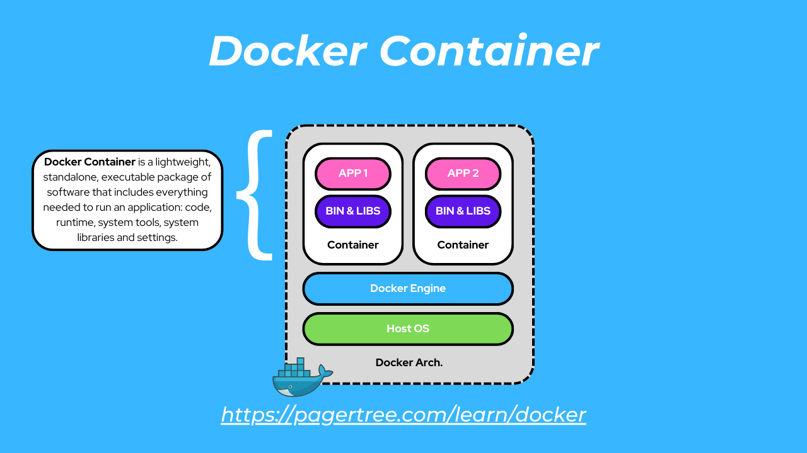

# What is Docker?

Docker is a platform used to package an application along with everything it needs to run, such as:

- Application code
- Dependencies
- Node modules
- Libraries
- Runtime
- Environment variables

All of these are packed into something called a **Docker container**.

---

# Simple Definition

**Docker** is a tool that helps developers run applications the same way on every computer by packaging the app and all its required files together.

This helps avoid problems like:

- “It works on my machine”
- Missing dependencies
- Different environments
- Version conflicts

A **Docker container** is a small isolated environment where an application runs.

Each container includes:
- The application
- Required dependencies
- Runtime
- Libraries
- Environment configuration

Because everything is included inside the container, the application can run properly on any system that has Docker installed.

---

# Understanding the Concept

From the image:

- The big box represents the **Docker Platform / Docker Engine**
- Inside Docker, there are multiple applications
- Each application is wrapped inside its own **container**
- Every container is isolated from other containers
- Each container has all the requirements needed to run that specific application

This isolation helps applications run independently without affecting each other.

---

# Why Docker is Useful

Docker helps developers:

- Run applications consistently everywhere
- Avoid environment-related issues
- Easily share applications
- Deploy applications faster
- Keep applications isolated and organized

---

# Main Idea of Docker

Docker basically creates the same environment everywhere, so the application runs consistently without crashing due to missing dependencies or system differences.